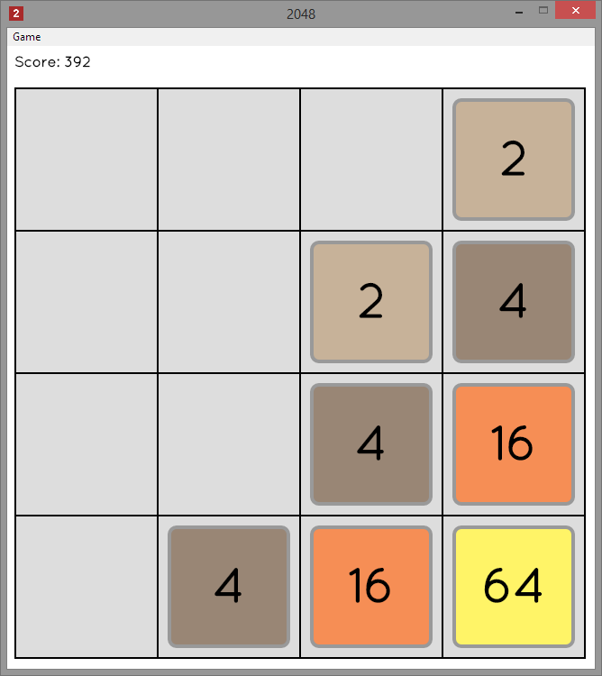

#2048
 
An 2048 clone written for Atom-Shell.
  

##Status

- There is no feedback when you get a 2048 tile
- There is no feedback when there are no moves left

##Release(s)

0.3.0 - http://github.com/frankhale/2048/releases/tag/v0.3.0

Currently there is only a Windows binary provided.

##Requirements

Atom-Shell - http://github.com/atom/atom-shell

##Directions

Use the arrow keys to move the tiles.

##Development

Want to make a change to the code? Or compile it? 

Requirements: io.js, grunt and bower

- Clone the repository
- open terminal to root folder
- type: npm install
- type: bower install
- type grunt

At this point the souce should be built and placed in the build folder.

The next step is to run it in Atom-Shell

copy all of the files to a folder called app and then copy app to Atom-Shell's
resources folder and then run atom-shell.
  
##License

GNU GPL v2
